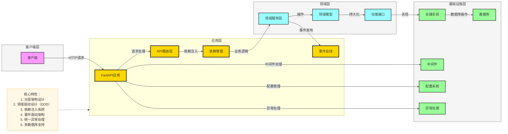

# FastAPI Enterprise Framework Template

## 项目概述

FastAPI Enterprise Framework Template 是一个基于FastAPI构建的现代化企业级API服务框架，采用**领域驱动设计（DDD）**和分层架构，支持事件驱动和模块化开发。该框架提供了完善的配置管理、多数据库支持、中间件系统、统一异常处理和事件总线，旨在帮助开发者快速构建高性能、可扩展、易于维护的API服务。

## 项目架构

### 整体架构

项目采用分层架构设计，包含客户端层、应用层、领域层和基础设施层。详细架构图和模块说明请参考以下文档：
- `docs/1. 项目架构图.md` - 详细架构图
- `docs/2. mermaid架构图参考风格.md` - 架构图风格参考
- `docs/3. 安装和使用指南.md` - 安装和使用文档



### 目录结构

```
fastapi-enterprise-framework-template/
├── src/                      # 主应用目录
│   ├── api/                  # API路由层
│   │   └── v1/               # API v1版本
│   ├── config/               # 配置管理
│   ├── dependencies/         # 依赖注入
│   ├── domains/              # 领域层（DDD）
│   ├── exception/            # 异常处理
│   ├── infrastructure/       # 基础设施层
│   ├── middleware/           # 中间件
│   ├── schemas/              # 应用层模式
│   └── utils/                # 工具函数
├── docs/                     # 设计文档
├── examples/                 # 使用示例
├── tests/                    # 测试代码
├── main.py                   # 项目入口
├── pyproject.toml            # 项目配置
└── README.md                 # 项目文档
```

## 快速开始

### 安装依赖

```bash
pip install -e .
```

### 安装AgentScope功能依赖

根据您的需求，您可以安装特定功能的依赖：

```bash
# 安装 A2A 功能依赖
pip install agentscope[a2a]

# 安装实时语音功能依赖
pip install agentscope[realtime]

# 安装所有模型支持
pip install agentscope[models]

# 安装 RAG 功能依赖
pip install agentscope[rag]

# 安装完整依赖
pip install agentscope[full]
```

### 运行应用

```bash
python main.py
```

### 访问API文档

- Swagger UI: http://localhost:8000/docs
- ReDoc: http://localhost:8000/redoc

## 配置选项

### 环境变量

| 变量名 | 描述 | 默认值 |
|--------|------|--------|
| UVICORN_RELOAD | 启用热重载模式 | true |
| UVICORN_HOST | 服务器绑定地址 | 0.0.0.0 |
| UVICORN_PORT | 服务器绑定端口 | 8000 |
| APP_NAME | 应用名称 | FastAPI Enterprise |
| APP_VERSION | 应用版本 | 1.0.0 |
| API_V1_STR | API v1前缀 | /api/v1 |

### 命令行参数

```bash
python main.py [options]

选项：
  -h, --help     显示帮助信息
  --reload       启用热重载模式
  --host HOST    服务器绑定地址
  --port PORT    服务器绑定端口
```

## 开发指南

### 添加新领域

1. 在`src/domains/`目录下创建新的领域目录
2. 定义领域模型（models）
3. 定义仓储接口（repositories）
4. 实现领域服务（services）
5. 定义领域模式（schemas）

### 添加新API路由

1. 在`src/api/v1/`目录下创建新的路由文件
2. 定义路由处理函数
3. 在`src/api/v1/__init__.py`中包含新路由
4. 配置必要的依赖注入

### 添加新事件

1. 在`src/infrastructure/events/`目录下定义新的事件类型
2. 在业务逻辑中发布事件
3. 定义事件处理器
4. 在应用启动时订阅事件

### 添加新中间件

1. 在`src/middleware/`目录下创建新的中间件
2. 在`main.py`中注册中间件

## 示例集合

为了帮助开发者更好地理解和使用该框架，我们提供了一系列示例代码，涵盖了框架的主要功能和使用场景。

### 示例列表

- **[快速入门](./examples/quickstart/)**：创建一个简单的API应用，了解框架的基本使用方法
- **[认证系统](./examples/auth/)**：实现完整的用户认证系统，包括JWT认证、OAuth2密码流等
- **[数据库操作](./examples/database/)**：使用仓储模式进行CRUD操作
- **[事件系统](./examples/events/)**：学习如何使用框架的事件总线，实现事件驱动架构

### 如何使用示例

1. 进入示例目录：`cd examples/<示例名称>`
2. 安装依赖：`pip install -r requirements.txt`
3. 运行应用：`python main.py`
4. 访问API文档：打开浏览器访问 `http://localhost:8000/docs`

## 测试

### 运行测试

```bash
pytest
```

### 查看测试覆盖率

```bash
pytest --cov=src
```

## 部署

### 生产环境部署

```bash
# 关闭热重载，指定生产环境配置
export UVICORN_RELOAD=false
export UVICORN_HOST=0.0.0.0
export UVICORN_PORT=8000
python main.py
```

### Docker部署

（示例Dockerfile）

```dockerfile
FROM python:3.11-slim

WORKDIR /app

COPY pyproject.toml .
RUN pip install --no-cache-dir -e .

COPY . .

CMD ["python", "main.py", "--reload=false"]
```

## 许可证

MIT License

## 贡献

欢迎提交Issue和Pull Request！

## 联系方式

如有问题或建议，请通过以下方式联系：

- 项目地址：https://github.com/yourusername/fastapi-enterprise-framework-template
- 邮件：your.email@example.com

## Agent 测试用例

### 5.1 启动实时语音智能体服务

```bash
# 从根目录直接启动实时语音智能体服务
python examples/agent_examples/agent/realtime_voice_agent/run_server.py
```

服务启动后，您应该能看到类似以下输出：

```
INFO:     Started server process [12345]
INFO:     Waiting for application startup.
INFO:     Application startup complete.
INFO:     Uvicorn running on http://0.0.0.0:8000 (Press CTRL+C to quit)
```

### 5.2 启动 A2A 智能体服务

A2A 智能体服务需要先启动服务器，然后再运行客户端：

**启动 A2A 服务器：**

```bash
# 从根目录直接启动 A2A 服务器
uvicorn examples/agent_examples/agent/a2a_agent/setup_a2a_server:app --host 0.0.0.0 --port 8000
```

**运行 A2A 客户端：**

```bash
# 在另一个终端中从根目录直接运行客户端
python examples/agent_examples/agent/a2a_agent/main.py
```

### 5.3 启动其他服务

**启动多智能体实时交互服务：**

```bash
# 从根目录直接启动多智能体实时交互服务
python examples/agent_examples/workflows/multiagent_realtime/run_server.py
```

服务启动后，您应该能看到类似以下输出：

```
INFO:     Will watch for changes in these directories: ['/path/to/agentscope/examples/workflows/multiagent_realtime']
INFO:     Uvicorn running on http://localhost:8000 (Press CTRL+C to quit)
INFO:     Started reloader process [12345] using WatchFiles
INFO:     Started server process [67890]
INFO:     Waiting for application startup.
INFO:     Application startup complete.
```

**验证服务：**

服务成功启动后，访问 http://localhost:8000 可以查看服务状态

服务运行正常，无错误信息