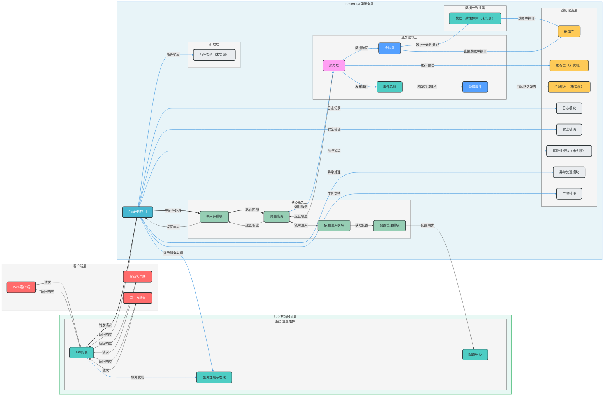

# FastAPI企业级框架项目架构图

## 项目架构总览



## 架构层次说明

| 层级 | 职责 | 核心模块 |
| --- | --- | --- |
| **客户端层** | 发起请求的外部系统 | Web客户端、移动客户端、第三方服务 |
| **独立基础设施层** | 提供企业级基础设施服务 | API网关（未实现）、服务注册与发现（未实现）、配置中心（未实现） |
| **FastAPI应用服务层** | 包含FastAPI应用的核心功能 |
| └─ **核心框架层** | 提供FastAPI基础框架支持 | 路由模块、中间件模块、依赖注入模块、配置管理模块 |
| └─ **业务逻辑层** | 封装核心业务逻辑 | 服务层、仓储层、领域事件、事件总线 |
| └─ **数据一致性层** | 保障分布式数据一致性 | 数据一致性保障机制（未实现） |
| └─ **基础设施层** | 提供应用内技术支持 | 数据库、缓存层（未实现）、消息队列（未实现）、日志模块、安全模块、观测性模块（未实现）、异常处理模块、工具模块 |
| └─ **扩展层** | 支持架构扩展 | 插件架构（未实现） |

## 核心模块功能说明

### 1. 独立基础设施层
- **API网关（未实现）**：负责请求路由、负载均衡、认证授权前置处理、限流与熔断、API版本管理
- **服务注册与发现（未实现）**：实现服务实例的自动注册和发现，支持动态扩缩容
- **配置中心（未实现）**：集中管理配置信息，支持配置热更新和多环境配置

### 2. 核心框架层
- **中间件模块**：处理请求前/后的通用逻辑，如CORS、日志记录、请求限流
- **路由模块**：定义API端点，支持API版本控制和路由分组
- **依赖注入模块**：管理应用依赖，提高代码可测试性和可维护性
- **配置管理模块**：管理应用配置，支持多环境配置和配置验证

### 3. 业务逻辑层
- **服务层**：封装核心业务逻辑，实现业务规则和流程
- **仓储层**：负责领域对象的持久化和检索，支持多种数据库
- **领域事件**：处理领域内的异步通信，实现业务解耦
- **事件总线**：管理事件的发布和订阅，支持跨模块通信

### 4. 数据一致性层
- **数据一致性保障（未实现）**：确保分布式环境下的数据一致性，支持事务管理和数据同步

### 5. 基础设施层
- **数据库**：存储业务数据，支持多种数据库类型
- **缓存层（未实现）**：提高数据访问性能，减少数据库负载
- **消息队列（未实现）**：实现异步通信，解耦系统组件
- **日志模块**：记录系统运行日志，支持结构化日志和日志分析
- **安全模块**：提供认证授权、输入验证、输出过滤等安全功能
- **观测性模块（未实现）**：实现监控、追踪、健康检查和告警功能
- **异常处理模块**：统一处理系统异常，提供标准化的错误响应
- **工具模块**：提供通用工具函数，如JWT处理、密码加密、请求处理等

### 6. 扩展层
- **插件架构（未实现）**：支持通过插件机制扩展功能，无需修改核心代码

## 技术栈

| 技术/框架 | 版本 | 用途 |
|-----------|------|------|
| fastapi | >=0.125.0 | Web框架 |
| uvicorn | >=0.30.0 | ASGI服务器 |
| pydantic-settings | >=2.0.0 | 配置管理 |
| python-dotenv | >=1.2.1 | 环境变量管理 |
| sqlalchemy | >=2.0.45 | ORM框架 |
| python-jose | >=3.5.0 | JWT处理 |
| bcrypt | >=5.0.0 | 密码加密 |
| python-multipart | >=0.0.21 | 表单数据处理 |
| passlib | >=1.7.4 | 密码哈希 |
| email-validator | >=2.3.0 | 邮箱验证 |
| slowapi | >=0.1.9 | 速率限制 |
| locust | >=2.42.6 | 性能测试 |
| pytest | >=9.0.2 | 测试框架（开发依赖） |
| pytest-cov | >=7.0.0 | 测试覆盖率（开发依赖） |
| httpx | >=0.27.0 | HTTP客户端（开发依赖） |

## 架构优势

- ✅ **分层设计清晰**：各层职责明确，耦合度低
- ✅ **DDD领域驱动设计**：业务逻辑与技术实现分离，便于维护和扩展
- ✅ **插件架构**：支持动态扩展，便于功能定制
- ✅ **全面的安全保障**：支持多种认证授权方式，防止常见安全漏洞
- ✅ **良好的观测性**：提供全面的监控、追踪和日志功能
- ✅ **异步支持**：充分利用FastAPI的异步特性，提高并发性能
- ✅ **类型安全**：使用Pydantic进行数据验证，确保类型安全
- ✅ **可测试性**：设计便于测试的架构，支持多种测试方式

## 目录结构设计规划

### 现有目录结构

```
src/
├── api/                     # API路由模块（按版本划分）
│   ├── v1/                  # v1版本API
│   │   ├── __init__.py
│   │   ├── auth.py          # 认证相关API
│   │   ├── health.py        # 健康检查API
│   │   └── users.py         # 用户相关API
│   └── __init__.py
├── config/                  # 配置模块
│   ├── __init__.py
│   ├── base.py              # 基础配置
│   ├── database.py          # 数据库配置
│   ├── logger.py            # 日志配置
│   └── settings.py          # 应用设置
├── dependencies/            # 依赖注入模块（通用依赖）
│   ├── __init__.py
│   ├── auth.py              # 认证依赖
│   ├── config.py            # 配置依赖
│   ├── database.py          # 数据库依赖
│   ├── db.py                # 数据库连接依赖
│   ├── rate_limit.py        # 速率限制依赖
│   ├── repository.py        # 仓储层依赖
│   └── service.py           # 服务层依赖
├── domains/                 # DDD领域模块
│   ├── base/                # 基础领域组件
│   │   ├── models/          # 基础数据模型
│   │   │   └── base.py
│   │   └── repositories/    # 基础仓储
│   │       └── base.py
│   └── user/                # 用户领域
│       ├── models/          # 用户数据模型
│       │   └── user.py
│       ├── repositories/    # 用户仓储
│       │   └── user_repository.py
│       ├── schemas/         # 用户数据校验Schema
│       │   └── user.py
│       └── services/        # 用户领域服务
│           └── user_service.py
├── exception/               # 异常处理模块
│   ├── __init__.py
│   ├── auth.py              # 认证异常
│   ├── base.py              # 基础异常
│   ├── business.py          # 业务异常
│   ├── database.py          # 数据库异常
│   ├── handler.py           # 异常处理器
│   ├── http.py              # HTTP异常
│   └── response.py          # 异常响应
├── infrastructure/          # 基础设施层
│   ├── database/            # 数据库连接管理
│   │   ├── sqlite/          # SQLite连接
│   │   │   └── connection.py
│   │   ├── base.py          # 数据库基础
│   │   └── manager.py       # 数据库管理器
│   ├── events/              # 事件系统
│   │   ├── __init__.py
│   │   ├── bus.py           # 事件总线
│   │   └── event.py         # 事件定义
│   └── repositories/        # 仓储实现
│       └── sqlite/          # SQLite仓储实现
│           └── user_repository.py
├── middleware/              # 中间件模块
│   ├── __init__.py
│   ├── authentication.py    # 认证中间件
│   ├── cors.py              # CORS中间件
│   ├── request.py           # 请求中间件
│   └── request_logger.py    # 请求日志中间件
├── schemas/                 # 通用Schema
│   ├── __init__.py
│   ├── response.py          # 通用响应Schema
│   └── user.py              # 用户相关Schema
├── utils/                   # 工具模块
│   ├── __init__.py
│   ├── jwt.py               # JWT工具
│   ├── password.py          # 密码工具
│   └── request.py           # 请求工具
└── __init__.py
```

### 规划目录结构（包含未实现模块）

```
src/
├── api/                     # API路由模块（按版本划分）
│   ├── v1/                  # v1版本API
│   │   ├── __init__.py
│   │   ├── auth.py          # 认证相关API
│   │   ├── health.py        # 健康检查API
│   │   └── users.py         # 用户相关API
│   ├── v2/                  # v2版本API（预留）
│   │   ├── __init__.py
│   │   └── users.py         # v2用户API（预留）
│   └── __init__.py
├── config/                  # 配置模块
│   ├── __init__.py
│   ├── base.py              # 基础配置
│   ├── database.py          # 数据库配置
│   ├── logger.py            # 日志配置
│   ├── security.py          # 安全配置（新增）
│   └── settings.py          # 应用设置
├── dependencies/            # 依赖注入模块（通用依赖）
│   ├── __init__.py
│   ├── auth.py              # 认证依赖
│   ├── config.py            # 配置依赖
│   ├── database.py          # 数据库依赖
│   ├── db.py                # 数据库连接依赖
│   ├── rate_limit.py        # 速率限制依赖
│   ├── repository.py        # 仓储层依赖
│   └── service.py           # 服务层依赖
├── domains/                 # DDD领域模块
│   ├── base/                # 基础领域组件
│   │   ├── models/          # 基础数据模型
│   │   │   └── base.py
│   │   └── repositories/    # 基础仓储
│   │       └── base.py
│   ├── user/                # 用户领域
│   │   ├── models/          # 用户数据模型
│   │   │   └── user.py
│   │   ├── repositories/    # 用户仓储
│   │   │   └── user_repository.py
│   │   ├── schemas/         # 用户数据校验Schema
│   │   │   └── user.py
│   │   └── services/        # 用户领域服务
│   │       └── user_service.py
│   ├── order/               # 订单领域（预留）
│   │   ├── models/          # 订单数据模型
│   │   ├── repositories/    # 订单仓储
│   │   ├── schemas/         # 订单数据校验Schema
│   │   └── services/        # 订单领域服务
│   └── product/             # 商品领域（预留）
│       ├── models/          # 商品数据模型
│       ├── repositories/    # 商品仓储
│       ├── schemas/         # 商品数据校验Schema
│       └── services/        # 商品领域服务
├── exception/               # 异常处理模块
│   ├── __init__.py
│   ├── auth.py              # 认证异常
│   ├── base.py              # 基础异常
│   ├── business.py          # 业务异常
│   ├── database.py          # 数据库异常
│   ├── handler.py           # 异常处理器
│   ├── http.py              # HTTP异常
│   └── response.py          # 异常响应
├── infrastructure/          # 基础设施层
│   ├── cache/               # 缓存模块（新增）
│   │   ├── __init__.py
│   │   ├── base.py          # 缓存基础
│   │   └── redis/           # Redis缓存实现
│   ├── database/            # 数据库连接管理
│   │   ├── sqlite/          # SQLite连接
│   │   │   └── connection.py
│   │   ├── postgres/        # PostgreSQL连接（预留）
│   │   ├── base.py          # 数据库基础
│   │   └── manager.py       # 数据库管理器
│   ├── events/              # 事件系统
│   │   ├── __init__.py
│   │   ├── bus.py           # 事件总线
│   │   └── event.py         # 事件定义
│   ├── logging/             # 日志模块（新增）
│   │   ├── __init__.py
│   │   └── formatter.py     # 日志格式化
│   ├── message_queue/       # 消息队列（新增）
│   │   ├── __init__.py
│   │   └── rabbitmq/        # RabbitMQ实现
│   ├── observability/       # 观测性模块（新增）
│   │   ├── __init__.py
│   │   ├── metrics.py       # 指标监控
│   │   ├── tracing.py       # 分布式追踪
│   │   └── health.py        # 健康检查
│   ├── repositories/        # 仓储实现
│   │   ├── sqlite/          # SQLite仓储实现
│   │   │   └── user_repository.py
│   │   └── postgres/        # PostgreSQL仓储实现（预留）
│   └── security/            # 安全模块（新增）
│       ├── __init__.py
│       └── encryption.py    # 加密工具
├── middleware/              # 中间件模块
│   ├── __init__.py
│   ├── authentication.py    # 认证中间件
│   ├── cors.py              # CORS中间件
│   ├── request.py           # 请求中间件
│   └── request_logger.py    # 请求日志中间件
├── plugins/                 # 插件架构（新增）
│   ├── __init__.py
│   ├── base.py              # 插件基础
│   └── manager.py           # 插件管理器
├── schemas/                 # 通用Schema
│   ├── __init__.py
│   ├── response.py          # 通用响应Schema
│   └── user.py              # 用户相关Schema
├── tasks/                   # 异步任务模块（新增）
│   ├── __init__.py
│   └── base.py              # 任务基础
├── utils/                   # 工具模块
│   ├── __init__.py
│   ├── jwt.py               # JWT工具
│   ├── password.py          # 密码工具
│   └── request.py           # 请求工具
└── __init__.py
```

### 目录结构说明

1. **api/**：API路由模块，按版本划分，支持API版本控制
2. **config/**：配置模块，管理应用配置，支持多环境配置
3. **dependencies/**：依赖注入模块，管理应用依赖，提高代码可测试性
4. **domains/**：DDD领域模块，按业务域划分，包含模型、仓储、服务等
5. **exception/**：异常处理模块，统一处理系统异常，提供标准化的错误响应
6. **infrastructure/**：基础设施层，包含数据库、缓存、消息队列等技术组件
7. **middleware/**：中间件模块，处理请求前/后的通用逻辑
8. **plugins/**：插件架构，支持通过插件机制扩展功能
9. **schemas/**：通用Schema，定义数据验证和传输对象
10. **tasks/**：异步任务模块，处理异步操作
11. **utils/**：工具模块，提供通用工具函数

### 设计原则

- **分层设计**：各层职责明确，耦合度低
- **模块化设计**：按业务域和技术功能划分模块
- **可扩展性**：预留扩展空间，支持新功能的无缝添加
- **一致性**：保持目录结构的一致性和可预测性
- **可维护性**：清晰的目录结构便于代码维护和理解

## 应用场景

本架构适用于：
- 企业级Web应用开发
- API服务构建
- 微服务架构基础
- 需要高并发、高可靠性的应用场景
- 需要快速开发和迭代的项目

通过使用本架构，开发团队可以快速构建高质量、可扩展的FastAPI应用，减少重复设计和实现工作，专注于业务逻辑开发。