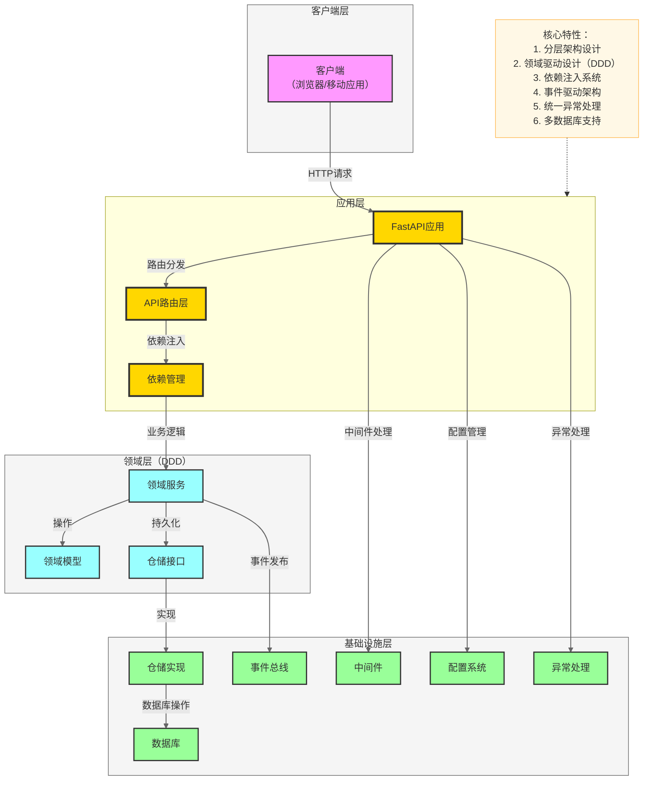
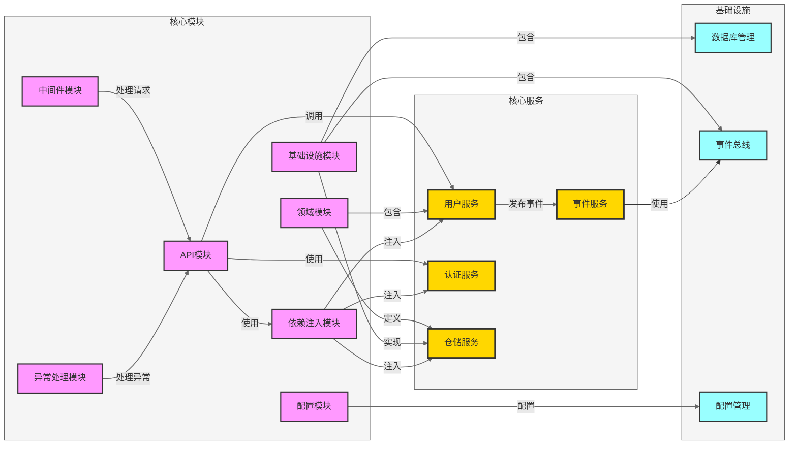

# 安装和使用指南

## 1. 环境准备

### 1.1 系统要求

- Python 3.9+ 
- pip 20.0+ 
- 操作系统：Windows、macOS、Linux

### 1.2 虚拟环境设置

推荐使用虚拟环境来隔离项目依赖：

```bash
# 创建虚拟环境
python -m venv venv

# 激活虚拟环境
# Windows
env\Scripts\activate
# macOS/Linux
source venv/bin/activate
```

## 2. 安装项目

### 2.1 从源码安装

```bash
# 克隆仓库
git clone https://github.com/yourusername/fastapi-enterprise-framework-template.git
cd fastapi-enterprise-framework-template

# 安装依赖
pip install -e .
```

### 2.2 安装可选依赖

```bash
# 安装开发依赖
pip install -e .[dev]

# 安装测试依赖
pip install -e .[test]
```

## 3. 项目架构

### 3.1 核心架构



### 3.2 模块关系



## 4. 快速使用

### 4.1 运行应用

```bash
# 开发模式（热重载）
python main.py

# 生产模式
python main.py --reload false
```

### 4.2 访问API文档

- Swagger UI: http://localhost:8000/docs
- ReDoc: http://localhost:8000/redoc

### 4.3 环境变量配置

创建 `.env` 文件来配置环境变量：

```env
# 服务器配置
UVICORN_RELOAD=true
UVICORN_HOST=0.0.0.0
UVICORN_PORT=8000

# 应用配置
APP_NAME=FastAPI Enterprise
APP_VERSION=1.0.0
API_V1_STR=/api/v1

# 数据库配置
DATABASE_URL=sqlite:///./test.db
```

## 5. 核心功能使用

### 5.1 认证系统

#### 5.1.1 用户注册

```bash
curl -X POST "http://localhost:8000/api/v1/auth/register" \
  -H "Content-Type: application/json" \
  -d '{"username": "testuser", "email": "test@example.com", "password": "password123"}'
```

#### 5.1.2 用户登录

```bash
curl -X POST "http://localhost:8000/api/v1/auth/login" \
  -H "Content-Type: application/json" \
  -d '{"username": "testuser", "password": "password123"}'
```

#### 5.1.3 访问受保护的资源

```bash
curl -X GET "http://localhost:8000/api/v1/users/me" \
  -H "Authorization: Bearer YOUR_ACCESS_TOKEN"
```

### 5.2 数据库操作

#### 5.2.1 创建用户

```python
from src.domains.user.services.user_service import UserService
from src.domains.user.schemas.user import UserCreate

# 创建用户服务实例
user_service = UserService()

# 创建新用户
user = user_service.create_user(
    UserCreate(
        username="newuser",
        email="newuser@example.com",
        password="password123"
    )
)
```

#### 5.2.2 查询用户

```python
# 根据ID查询用户
user = user_service.get_user_by_id(1)

# 根据用户名查询用户
user = user_service.get_user_by_username("testuser")
```

### 5.3 事件系统

#### 5.3.1 定义事件

```python
from src.infrastructure.events.event import Event

class UserCreatedEvent(Event):
    def __init__(self, user_id: int, username: str):
        self.user_id = user_id
        self.username = username
        super().__init__("user.created")
```

#### 5.3.2 发布事件

```python
from src.infrastructure.events.bus import event_bus

# 发布事件
event_bus.publish(UserCreatedEvent(user_id=1, username="testuser"))
```

#### 5.3.3 订阅事件

```python
from src.infrastructure.events.bus import event_bus

# 订阅事件
@event_bus.subscribe("user.created")
def handle_user_created(event: UserCreatedEvent):
    print(f"User created: {event.username} (ID: {event.user_id})")
```

## 6. 开发指南

### 6.1 项目结构

```
fastapi-enterprise-framework-template/
├── src/                      # 主应用目录
│   ├── api/                  # API路由层
│   │   └── v1/               # API v1版本
│   ├── config/               # 配置管理
│   ├── dependencies/         # 依赖注入
│   ├── domains/              # 领域层（DDD）
│   ├── exception/            # 异常处理
│   ├── infrastructure/       # 基础设施层
│   ├── middleware/           # 中间件
│   ├── schemas/              # 应用层模式
│   └── utils/                # 工具函数
├── docs/                     # 设计文档
├── examples/                 # 使用示例
├── tests/                    # 测试代码
├── main.py                   # 项目入口
├── pyproject.toml            # 项目配置
└── README.md                 # 项目文档
```

### 6.2 开发流程

1. **创建虚拟环境**：`python -m venv venv`
2. **激活虚拟环境**：`venv\Scripts\activate`（Windows）或 `source venv/bin/activate`（macOS/Linux）
3. **安装依赖**：`pip install -e .[dev]`
4. **运行应用**：`python main.py`
5. **编写代码**：在相应的模块中添加功能
6. **运行测试**：`pytest`
7. **提交代码**：确保代码通过测试后提交

### 6.3 代码规范

- 遵循 PEP 8 代码风格
- 使用类型提示
- 编写单元测试
- 添加详细的文档字符串
- 保持代码简洁明了

## 7. 测试

### 7.1 运行测试

```bash
# 运行所有测试
pytest

# 运行特定测试文件
pytest tests/test_api.py
pytest tests/test_config.py -v

# 查看测试覆盖率
pytest --cov=src
```

### 7.2 测试最佳实践

- 为每个模块编写单元测试
- 测试边界情况
- 使用 fixtures 来设置测试环境
- 模拟外部依赖
- 保持测试代码简洁明了

## 8. 部署

### 8.1 生产环境部署

```bash
# 关闭热重载，指定生产环境配置
export UVICORN_RELOAD=false
export UVICORN_HOST=0.0.0.0
export UVICORN_PORT=8000
python main.py
```

### 8.2 Docker部署

#### 8.2.1 创建Dockerfile

```dockerfile
FROM python:3.11-slim

WORKDIR /app

COPY pyproject.toml .
RUN pip install --no-cache-dir -e .

COPY . .

CMD ["python", "main.py", "--reload=false"]
```

#### 8.2.2 构建和运行Docker镜像

```bash
# 构建镜像
docker build -t fastapi-enterprise .

# 运行容器
docker run -d -p 8000:8000 fastapi-enterprise
```

### 8.3 部署到云服务

- **AWS**：使用 EC2 或 ECS
- **Azure**：使用 App Service
- **GCP**：使用 Cloud Run
- **Heroku**：直接部署

## 9. 常见问题

### 9.1 依赖安装问题

**问题**：安装依赖时出现错误

**解决方案**：
- 确保 Python 版本 >= 3.9
- 确保 pip 版本 >= 20.0
- 尝试使用 `pip install --upgrade pip` 升级 pip
- 尝试使用 `pip install -e . --no-cache-dir` 安装

### 9.2 运行时问题

**问题**：应用启动失败

**解决方案**：
- 检查端口是否被占用
- 检查环境变量配置
- 检查数据库连接
- 查看控制台错误信息

### 9.3 数据库问题

**问题**：数据库连接失败

**解决方案**：
- 检查数据库 URL 配置
- 确保数据库服务正在运行
- 确保数据库用户有正确的权限

## 10. 联系方式

如有问题或建议，请通过以下方式联系：

- 项目地址：https://github.com/yourusername/fastapi-enterprise-framework-template
- 邮件：your.email@example.com
- Issue：在 GitHub 仓库中提交 Issue

## 11. 许可证

MIT License
